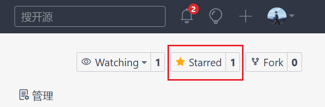

## star
记得点击小星星给项目一个star
https://gitee.com/ku-ki



## 请使用 pnpm 进行构建管理项目

### 使用 npm 安装 pnpm

```shell
npm install -g pnpm
```

### 使用 PowerShell 安装

```shell
iwr https://get.pnpm.io/install.ps1 -useb | iex
```

### 修改淘宝镜像

```shell
pnpm config set registry https://registry.npm.taobao.org
````

## 安装依赖

```sh
pnpm install
```

### 启动项目

```sh
pnpm serve
```

### 构建

```sh
pnpm build
```

### Run Unit Tests with [Vitest](https://vitest.dev/)

```sh
pnpm test:unit
```

### Run End-to-End Tests with [Playwright](https://playwright.dev)

```sh
# Install browsers for the first run
npx playwright install

# When testing on CI, must build the project first
pnpm build

# Runs the end-to-end tests
pnpm test:e2e
# Runs the tests only on Chromium
pnpm test:e2e --project=chromium
# Runs the tests of a specific file
pnpm test:e2e tests/example.spec.ts
# Runs the tests in debug mode
pnpm test:e2e --debug
```

### Lint with [ESLint](https://eslint.org/)

```sh
pnpm lint
```
